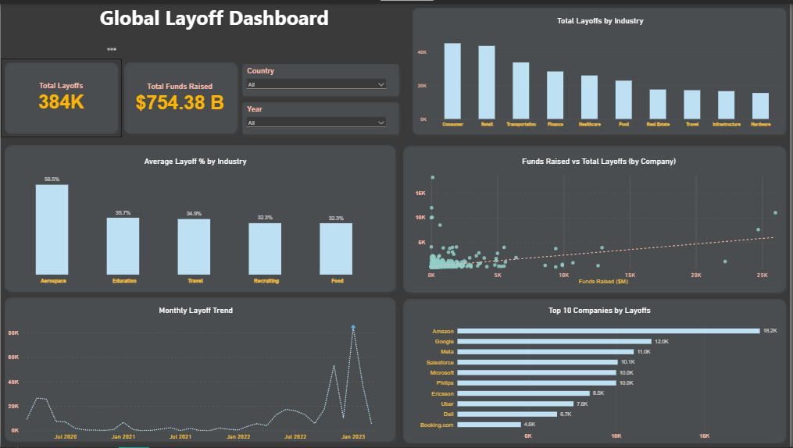
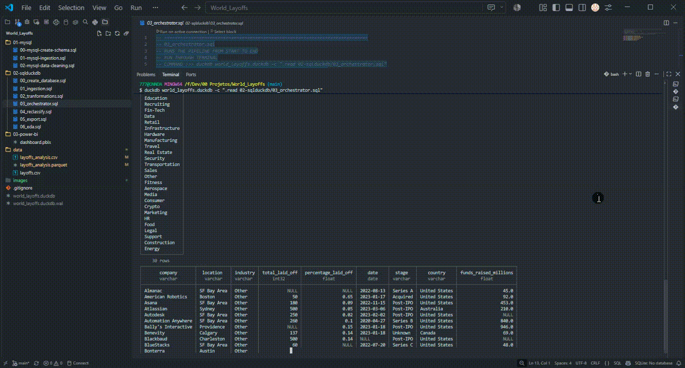
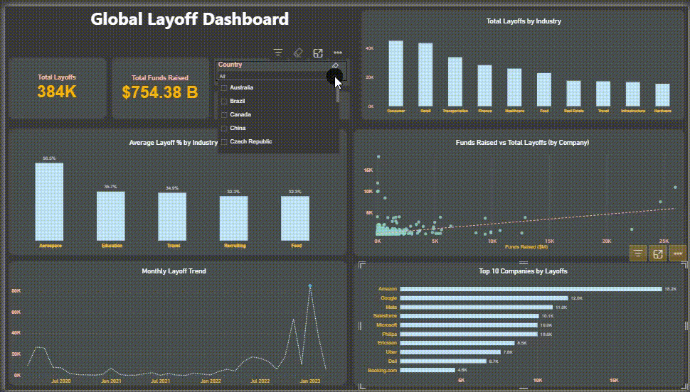

# 🌍 World Layoffs: SQL Pipeline & Power BI Dashboard

An end-to-end data project that cleans a global layoffs dataset with SQL (MySQL and DuckDB), exports an analysis-ready table, and presents the findings in an interactive Power BI dashboard.



---

## 📌 Project Overview

| Item | Detail |
|---|---|
| **Domain** | Global company layoffs, March 2020 to March 2023 |
| **Raw data** | 2,361 rows, 9 columns (`data/layoffs.csv`) |
| **Clean data** | 2,356 rows, 1,885 unique companies, 31 industries |
| **Total layoffs** | 383,659 employees |
| **Engines** | MySQL, DuckDB |
| **Visualization** | Power BI |

The goal is to show a reproducible path from messy raw data to business-ready insights: ingestion, deduplication, standardization, null handling, reclassification, export and reporting.

---

## 🎬 Demo

| DuckDB Pipeline | Power BI Dashboard |
|---|---|
|  |  |

---

## 🏗️ Architecture

```
data/layoffs.csv (raw)
        │
        ▼
 01_ingestion.sql        → raw table (all columns as text)
        │
        ▼
 02_tranformations.sql   → dedup, standardization, type casting, null handling
        │                  → layoffs_formated → layoffs_cleaned (silver layer)
        ▼
 04_reclassify.sql       → industry reclassification → layoffs_analysis
        │
        ▼
 05_export.sql           → data/layoffs_analysis.csv + .parquet
        │
        ▼
 03-power-bi/dashboard.pbix
```

The same cleaning logic was first built in MySQL (`01-mysql/`) and then rebuilt in DuckDB (`02-sqlduckdb/`) as a single, orchestrated pipeline.

---

## 📁 Repository Structure

```
world-layoffs/
├── 01-mysql/
│   ├── 00-mysql-create-schema.sql     # Schema and raw table
│   ├── 01-mysql-ingestion.sql         # Staging copy, duplicate detection
│   └── 02-mysql-data-cleaning.sql     # Cleaning and standardization
├── 02-sqlduckdb/
│   ├── 00_create_database.sql         # Database creation
│   ├── 01_ingestion.sql               # Raw CSV ingestion
│   ├── 02_tranformations.sql          # Cleaning and standardization
│   ├── 03_orchestrator.sql            # Runs the pipeline end to end
│   ├── 04_reclassify.sql              # Industry reclassification
│   ├── 05_export.sql                  # Export for Power BI
│   └── 06_eda.sql                     # Queries matching each dashboard visual
├── 03-power-bi/
│   └── dashboard.pbix                 # Global Layoff Dashboard
├── data/
│   ├── layoffs.csv                    # Raw dataset
│   ├── layoffs_analysis.csv           # Clean export
│   └── layoffs_analysis.parquet       # Clean export (columnar)
└── images/                            # Dashboard screenshot and demo GIFs
```

---

## 🧹 Data Quality & Cleaning

| Step | What was done |
|---|---|
| **Duplicates** | Identified with `ROW_NUMBER()` over all columns; 5 duplicate rows removed (2,361 → 2,356) |
| **Standardization** | Trimmed company names, unified `Düsseldorf`, consolidated crypto industry variants, removed trailing periods from country names |
| **Type casting** | Text `'NULL'` strings converted to real nulls; dates parsed from `m/d/Y`; numeric columns cast safely with `TRY_CAST` |
| **Industry nulls** | Filled from other rows of the same company; one remaining case set to `Other` manually |
| **Company names** | 5 companies appeared under two spellings (ByteDance, Clearco, Curefit, Salesloft, Appgate) and were merged; validated with a zero-duplicate check |
| **Funding outlier** | Netflix carried a funding value of 121,900M (about $121.9B) in the source file, which is not realistic. Public sources disagree on the true figure, so the value was set to `NULL` rather than replaced with an unverified number |
| **Missing date** | 1 row (500 layoffs) has no date. It counts in the total but not in the monthly trend |

---

## 📊 Dashboard

**KPIs**
- **Total Layoffs:** 384K
- **Total Funds Raised:** $754.38B, counted once per company (maximum per company), because funding repeats on every layoff round of the same company

**Visuals**
- **Total Layoffs by Industry:** top 10 industries by sum of layoffs
- **Average Layoff % by Industry:** top 5 industries by average share of the workforce laid off
- **Funds Raised vs Total Layoffs (by Company):** one point per company
- **Monthly Layoff Trend:** continuous year-month series
- **Top 10 Companies by Layoffs**
- **Slicers:** Country and Year

Every visual has a matching query in `02-sqlduckdb/06_eda.sql`, and the results were reconciled against the dashboard.

---

## 🔎 Key Insights

- **Consumer (45.2K), Retail (43.6K) and Transportation (33.7K)** lead in total layoffs.
- **Amazon (18,150), Google (12,000) and Meta (11,000)** are the three companies with the most layoffs.
- **Layoffs peaked in January 2023 (84.7K)**, followed by November 2022 (53.5K). A first spike appears in April and May 2020 (about 26K per month).
- **Aerospace has the highest average layoff share (56.5%)**, but it is a small industry (661 layoffs in total), so the average reflects a few companies with deep cuts.
- **Funding and layoffs show no strong relationship** in the company-level scatter: several heavily funded companies cut few jobs, and Amazon cut the most with relatively low recorded funding.

---

## 🚀 How to Run

**DuckDB pipeline**

```bash
duckdb world_layoffs.duckdb -c ".read 02-sqlduckdb/03_orchestrator.sql"
```

The orchestrator runs ingestion, transformations, reclassification, export and the EDA queries in order. The clean table is exported to `data/` for Power BI.

**MySQL version**

Run the scripts in `01-mysql/` in order: `00` → `01` → `02`.

**Dashboard**

Open `03-power-bi/dashboard.pbix` in Power BI Desktop and refresh the data source if the file path differs on your machine.

---

## ⚠️ Notes & Limitations

- The dataset covers March 2020 to March 2023; the last month is incomplete.
- Funding values come from the source file and were not independently verified, apart from the Netflix outlier.
- Average layoff percentage is sensitive to small companies with very large cuts; the median gives a more robust view.

---

## 🛠️ Tech Stack

SQL · MySQL · DuckDB · Power BI · Parquet · Git

---